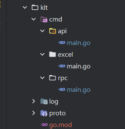

# 基础教程

> 下面我们会一步一步构建一个相对完整的项目
> 
> [示例项目](https://github.com/thkhxm/tgf_example/tree/main/rpc-start)

## 项目结构
一个标准项目中我们通常会包含以下几个包,我们会分别介绍他们的功能

common
: 主要存放自动生成的代码文件,pb,项目通用结构参数,通用错误码,通用异常,rpc和api接口等,我们通常会在这个项目中对tgf框架进行引入,这样在整个work环境中,就无需多次引入了.

kit
: 工具项目,主要负责存放pb执行相关文件脚本,api,rpc,excel导出json,配置文件导出 等自动生成脚本,或者文档和sql脚本等.

service
: 业务逻辑服务项目,项目名称根据业务而定. 主要是业务核心逻辑,对外只提供少量接口,逻辑在internal路径下进行开发


## 创建接口
在项目开发前,我们需要先对我们提供的接口进行定义,而这些接口的定义一般我们会放在通用项目中,即Common项目下,
例如:




> 按照一个服务一个文件的规范,为每一个服务添加一份接口.
> 

这是A服务的接口,提供了一个面向用户的api接口
```Go
package service

import (
	"github.com/thkhxm/tgf/rpc"
	"github.com/thkhxm/tgf_example/common/pb"
	"golang.org/x/net/context"
)

//***************************************************
//@Link  https://github.com/thkhxm/tgf
//@Link  https://gitee.com/timgame/tgf
//@QQ群 7400585
//author tim.huang<thkhxm@gmail.com>
//@Description
//2023/11/22
//***************************************************

type IAService interface {
	Buy(ctx context.Context, args *rpc.Args[*pb.DefaultRequest], reply *rpc.Reply[*pb.DefaultRequest]) (err error)
}

type IARPCService interface {
}

```

这是B服务的接口,提供了一个Rpc接口,其他服务可以通过该接口进行rpc的调用
```Go
package service

import (
	bmodels "github.com/thkhxm/tgf_example/common/rpc/b"
	"golang.org/x/net/context"
)

//***************************************************
//@Link  https://github.com/thkhxm/tgf
//@Link  https://gitee.com/timgame/tgf
//@QQ群 7400585
//author tim.huang<thkhxm@gmail.com>
//@Description
//2023/11/22
//***************************************************

type IBService interface {
}

type IBRPCService interface {
	BuyItem(ctx context.Context, args *bmodels.BuyParam, reply *bmodels.ItemData) (err error)
}

```

## 自动生成代码
我们在定义完接口之后,可以使用框架提供的代码生成能力,自动生成接口的定义代码
### 创建自动生成脚本
我们可以在kit项目中,创建一个api目录,如下图:


#### api
```Go
package main

import (
	"github.com/thkhxm/tgf/util"
	"github.com/thkhxm/tgf_example/common/service"
)

//***************************************************
//@Link  https://github.com/thkhxm/tgf
//@Link  https://gitee.com/timgame/tgf
//@QQ群 7400585
//author tim.huang<thkhxm@gmail.com>
//@Description
//2023/5/29
//***************************************************

func main() {
	util.SetAutoGenerateAPICodePath("../common/api")
	//util.SetAutoGenerateAPICSCode("E:\\unity\\project\\t2\\Assets\\HotFix\\Code", "HotFix.Code")
	util.GeneratorAPI[service.IAService]("a", "v1.0", "api")
	//util.GeneratorAPI[service.IPropService](prop.ModuleName, prop.Version, "api",
	//	"UpdatePropItemPush")
	//util.GenerateCSApiService()
}

```

`util.SetAutoGenerateAPICodePath("../common/api")` 表示golang文件的生成目录
`util.GeneratorAPI[service.IAService]("a", "v1.0", "api")` 表示根据`service.IAService`生成对应的api,其中第一个参数`"a"`表示模块名称,
`"v1.0"`表示服务的版本,`"api"` 表示输出的自定义包路径,即 `package api`.

> 假如您的项目中使用的是C#代码,那么还可以使用配套的C#代码,以上代码中已注释

#### rpc
```Go
package main

import (
	"github.com/thkhxm/tgf/util"
	"github.com/thkhxm/tgf_example/common/service"
)

//***************************************************
//@Link  https://github.com/thkhxm/tgf
//@Link  https://gitee.com/timgame/tgf
//@QQ群 7400585
//author tim.huang<thkhxm@gmail.com>
//@Description
//2023/8/31
//***************************************************

func main() {
	util.SetAutoGenerateAPICodePath("../common/api")
	util.SetGenerateFileNameSuffix("rpc")
	util.GeneratorRPC[service.IBRPCService]("b", "v1.0", "bservice", "b")
	//util.GeneratorRPC[service.IUserRPCService](user.ModuleName, user.Version, "userservice", "user")
}

```
`util.SetGenerateFileNameSuffix("rpc")` 定义生成的go文件后缀,用于区分api文件
`util.GeneratorRPC[service.IBRPCService]("b", "v1.0", "bservice", "b")` 生成rpc文件,其中前三个参数与api一样,代表模块名和版本号,包名, 最后的`"b"`参数,表示的文件夹名称,
这里是因为我们需要对每一个rpc都单独一个路径,方便在使用的时候,具有差异化可以快速使用.一般使用模块名作为文件夹名称.

### 代码解释
这里我们简单对代码进行一下解释
```Go

//Auto generated by tgf util
//created at 2023-11-22 12:40:57.3561753 +0800 CST m=+0.033412601

package bservice

import (

"github.com/thkhxm/tgf/rpc"

"github.com/thkhxm/tgf_example/common/rpc/b"

)
var bService = &rpc.Module{Name: "b", Version: "v1.0"}

var (
	
	BuyItem = rpc.ServiceAPI[*bmodels.BuyParam, *bmodels.ItemData]{
		ModuleName: bService.Name,
		Name:       "BuyItem",
		MessageType: bService.Name+"."+"BuyItem",
	}
	
)

```
以上代码,是自动生成的,我们只需要关注两个地方,第一个 `package bservice` 这是我们在使用这个rpc接口的时候,使用到的包,`BuyItem` 这是我们的rpc入口.

### 示例代码
AService
```Go
package a

import (
	"github.com/thkhxm/tgf"
	"github.com/thkhxm/tgf/log"
	"github.com/thkhxm/tgf/rpc"
	bservice "github.com/thkhxm/tgf_example/common/api/b"
	"github.com/thkhxm/tgf_example/common/pb"
	bmodels "github.com/thkhxm/tgf_example/common/rpc/b"
	"golang.org/x/net/context"
)

//***************************************************
//@Link  https://github.com/thkhxm/tgf
//@Link  https://gitee.com/timgame/tgf
//@QQ群 7400585
//author tim.huang<thkhxm@gmail.com>
//@Description
//2023/11/22
//***************************************************

// Service
// @Description: implements define.IAService , define.IARPCService
type Service struct {
	rpc.Module
}

func (s *Service) Buy(ctx context.Context, args *rpc.Args[*pb.DefaultRequest], reply *rpc.Reply[*pb.DefaultRequest]) (err error) {
	res, e := rpc.SendRPCMessage(ctx, bservice.BuyItem.New(&bmodels.BuyParam{
		PropId: "1001",
		Count:  3,
	}, &bmodels.ItemData{}))
	if e != nil {
		log.Error("rpc error %v", e)
		return e
	}
	log.InfoTag("example", "Buy Item res: %v", res)
	return
}

func (s *Service) GetName() string {
	return "a"
}

func (s *Service) GetVersion() string {
	return "v1.0"
}

func (s *Service) Startup() (bool, error) {
	return true, nil
}

func Startup() {
	c := rpc.NewRPCServer(). //创建一个rpc服务
					WithGatewayWS("8032", "/example"). //启动一个网关
					WithService(&Service{}).           //启动一个service的服务
					WithWhiteService("Buy").           //添加该rpc到白名单,无需登录即可访问
					WithCache(tgf.CacheModuleClose).
					WithRandomServicePort(8000, 8010).
					Run()
	select {
	case <-c:
		log.InfoTag("service", "service is down ")

	}
}
```
BService
```Go
package b

import (
	"github.com/thkhxm/tgf"
	"github.com/thkhxm/tgf/log"
	"github.com/thkhxm/tgf/rpc"
	bmodels "github.com/thkhxm/tgf_example/common/rpc/b"
	"golang.org/x/net/context"
)

//***************************************************
//@Link  https://github.com/thkhxm/tgf
//@Link  https://gitee.com/timgame/tgf
//@QQ群 7400585
//author tim.huang<thkhxm@gmail.com>
//@Description
//2023/11/22
//***************************************************

// Service
// @Description: implements define.IBService , define.IBRPCService
type Service struct {
	rpc.Module
}

func (s *Service) BuyItem(ctx context.Context, args *bmodels.BuyParam, reply *bmodels.ItemData) (err error) {
	reply.PropId = args.PropId
	reply.Count = args.Count * 2
	reply.Name = "买一送一特价商品"
	log.DebugTag("example", "args:%v,reply:%v", args, reply)
	return
}

func (s *Service) GetName() string {
	return "b"
}

func (s *Service) GetVersion() string {
	return "v1.0"
}

func (s *Service) Startup() (bool, error) {
	return true, nil
}

func Startup() {
	c := rpc.NewRPCServer(). //创建一个rpc服务
					WithService(&Service{}). //启动一个service的服务
					WithCache(tgf.CacheModuleClose).
					WithRandomServicePort(8010, 8020).
					Run()
	select {
	case <-c:
		log.InfoTag("service", "service is down ")
	}
}
```

Client
```Go
func TestService_Buy(t *testing.T) {
	//创建一个websocket的机器人
	client := robot.NewRobotWs("/example")
	//连接到指定路径
	client.Connect("127.0.0.1:8032")
	client.Send(api.Buy.MessageType, &pb.DefaultRequest{})
	select {}
}
```
完整调用流程图


> 如果需要完整代码,可以在示例项目中查看.